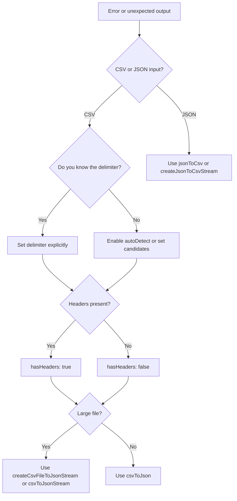

# Troubleshooting
Current version: 3.1.0

This guide lists common JTCSV issues and practical fixes.

## Quick triage
1. Confirm the input format (CSV vs JSON).
2. Confirm the delimiter (comma, semicolon, tab, pipe).
3. Check if the file is large (prefer streaming when >10MB).
4. Check the first line for headers.
5. Re-run with `onError: 'warn'` and capture the line number.

## Decision tree (mermaid)


## Common errors and fixes (20+)
| Error or symptom | Likely cause | Fix | Example |
| --- | --- | --- | --- |
| Parsing error: wrong columns | Delimiter mismatch | Set `delimiter` explicitly | `csvToJson(csv, { delimiter: ';' })` |
| Field count mismatch | Row has extra separators | Fix input or set correct delimiter | `csvToJson(csv, { delimiter: ',' })` |
| Unclosed quotes | Quotes not balanced | Fix CSV quoting or escape quotes | `"a,""b"""` |
| Empty output | `hasHeaders` wrong | Set `hasHeaders: false` for headerless CSV | `csvToJson(csv, { hasHeaders: false })` |
| First row missing | `hasHeaders` true but no headers | Set `hasHeaders: false` | `csvToJson(csv, { hasHeaders: false })` |
| Wrong header names | Needs renaming | Use `renameMap` | `csvToJson(csv, { renameMap: { old: 'new' } })` |
| Unexpected nulls | `trim` + empty cells | Set `trim: false` or adjust data | `csvToJson(csv, { trim: false })` |
| Booleans as strings | `parseBooleans` off | Enable boolean parsing | `csvToJson(csv, { parseBooleans: true })` |
| Numbers as strings | `parseNumbers` off | Enable number parsing | `csvToJson(csv, { parseNumbers: true })` |
| Delimiter auto-detect wrong | Similar counts in first line | Provide `delimiter` or `candidates` | `csvToJson(csv, { candidates: [';', ','] })` |
| Large file is slow | In-memory parse | Switch to streaming | `createCsvFileToJsonStream('big.csv')` |
| Memory limit error | `memoryLimit` too low | Increase limit or stream | `csvToJson(csv, { memoryLimit: Infinity })` |
| Max rows exceeded | `maxRows` too low | Increase `maxRows` | `csvToJson(csv, { maxRows: 2_000_000 })` |
| Security error (CSV injection) | Formula-like cells | Keep protection or escape data | `preventCsvInjection: true` |
| Invalid delimiter error | Multi-char delimiter | Use a single character | `delimiter: '|'` |
| File not found | Bad path or permissions | Check path and access | `readCsvAsJson('data.csv')` |
| Invalid file extension | `createCsvFileToJsonStream` requires `.csv` | Rename or use string API | `createCsvFileToJsonStream('data.csv')` |
| Schema validation fails | Schema mismatch | Update schema or input | `csvToJson(csv, { schema })` |
| Transform error | Custom transform throws | Fix transform or add try/catch | `transform: (row) => ({ ...row })` |
| Browser file parse fails | Not using browser entry | Use `jtcsv/browser` | `import { parseCsvFile } from 'jtcsv/browser'` |
| Worker helpers not available | Missing worker build | Use non-worker path | `parseCsvFile(file)` |
| NDJSON expected | Output format confusion | Use NDJSON helpers | `npx jtcsv csv-to-ndjson data.csv --stream` |
| UTF-8 BOM issues | BOM present | Use BOM stripping utilities | `autoDetectDelimiter` or normalize input |
| Stream output is objects | Streaming returns rows | Collect or process row-by-row | `for await (const row of stream)` |

## Debugging strategies
- Add row-level logging:
```javascript
const rows = csvToJson(csv, {
  onError: 'warn',
  errorHandler: (error, line, lineNumber) => {
    console.warn('bad row', lineNumber, error.message, line);
  }
});
```
- Force delimiter to validate assumptions.
- Re-run with `hasHeaders: false` to isolate header problems.
- Reduce data to 5-10 lines and confirm behavior.

## Performance troubleshooting
- Use streaming for large files:
```javascript
const stream = await createCsvFileToJsonStream('large.csv');
for await (const row of stream) {
  // process rows
}
```
- Prefer `fastPathMode: 'compact'` if memory is tight.
- Avoid converting huge CSV strings in memory.

## When to open an issue
Include:
- Input sample (10-20 lines)
- Your options object
- Node.js version and OS
- Expected vs actual output
